# 📚 E‑Learning App

A full-stack learning platform that lets students enroll, study structured theory, practice timed or untimed quizzes, and track their progress. It pairs a Django REST Framework backend with a modern React + Vite frontend and ships with ready-to-use screenshots so you can demo the UX quickly.

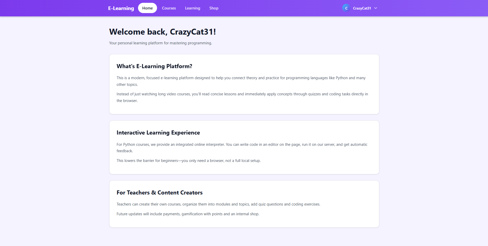

## 1) What this app is & tech stack

### 🧠 Core capabilities
- Public course catalog with search, filters, and per-course detail pages.
- Enrollment flow with JWT-secured sessions so learners can save progress.
- Theory-first learning per topic, followed by practice quizzes (single and multiple choice) with scoring, timers, and history.
- Progress tracking that surfaces completion, scores, and test history for each topic.
- Responsive UI that adapts to mobile screens.

### 🛠️ Technologies
- **Backend:** Django 5 + Django REST Framework, Simple JWT for auth, django-filter, PostgreSQL.
- **Frontend:** React 19, Vite, React Router, Redux Toolkit, Axios.
- **Dev tooling:** ESLint, Vite hot reload, Django admin for content creation.

### 🖼️ UI preview
<div align="center">

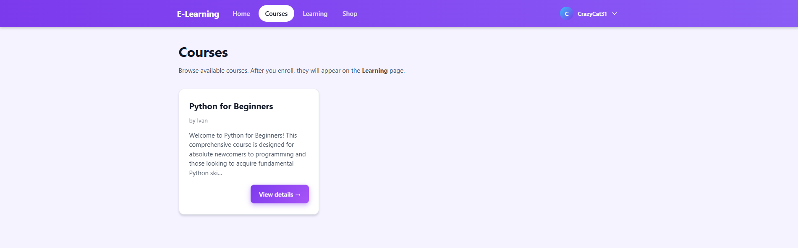

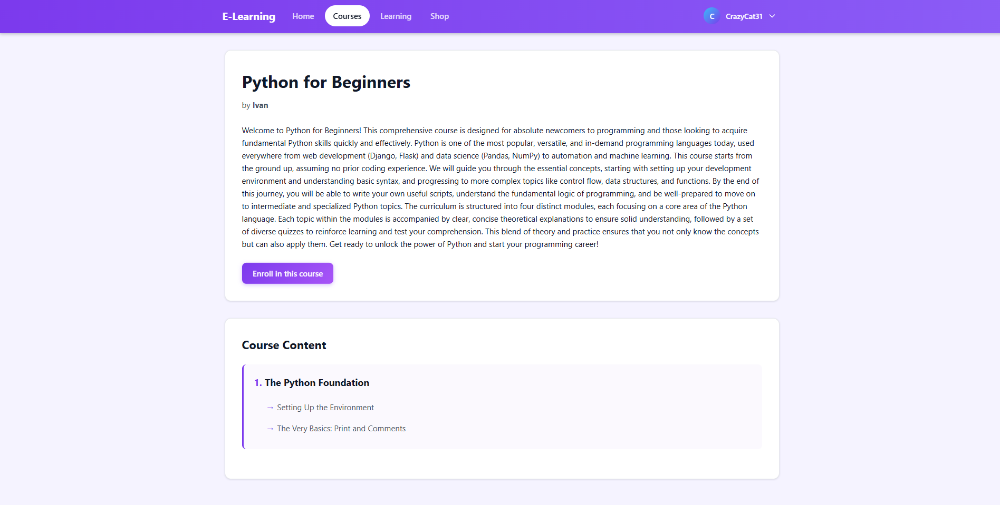

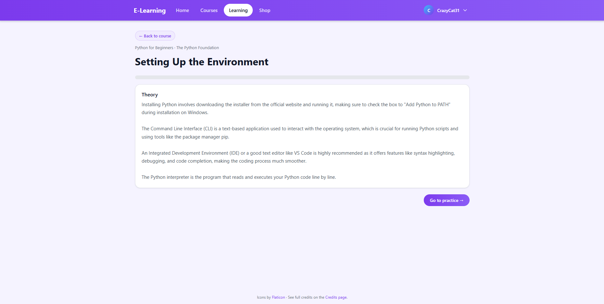

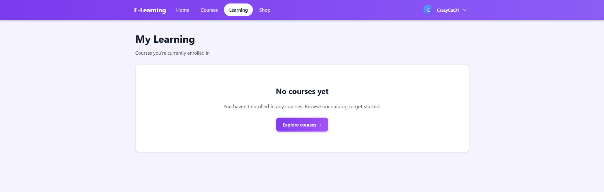

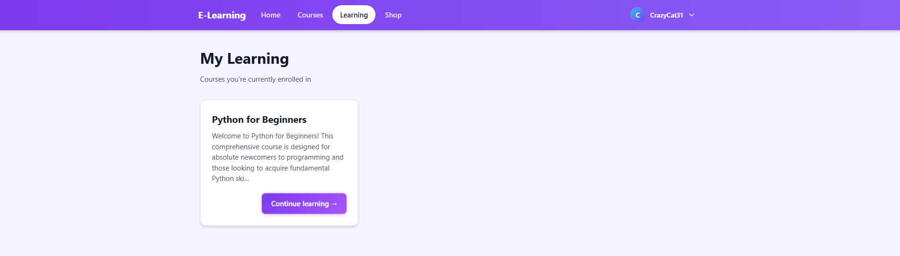

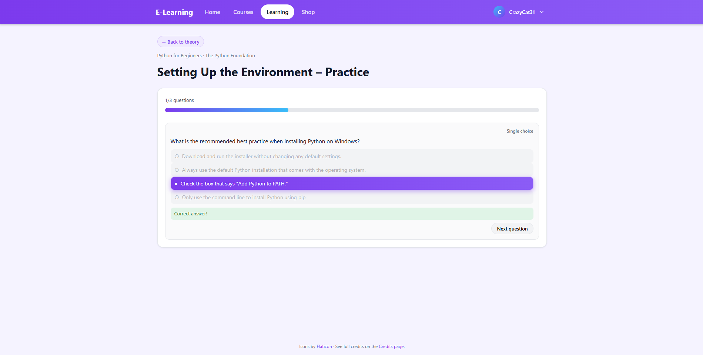

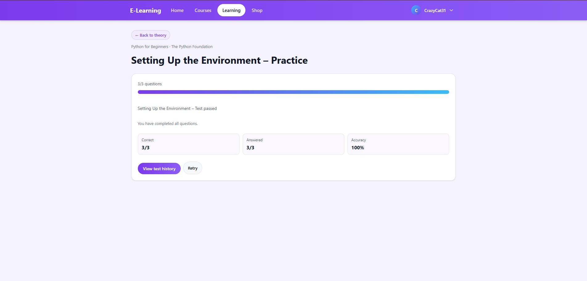

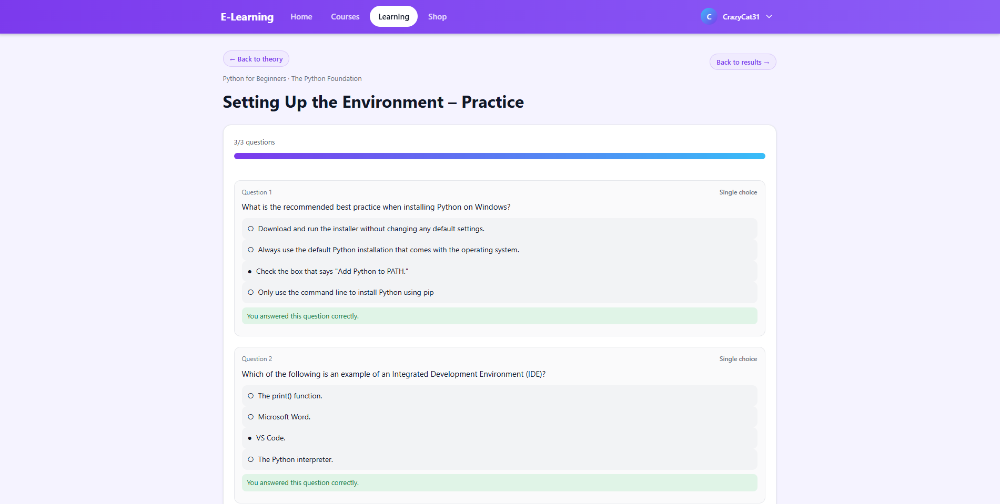

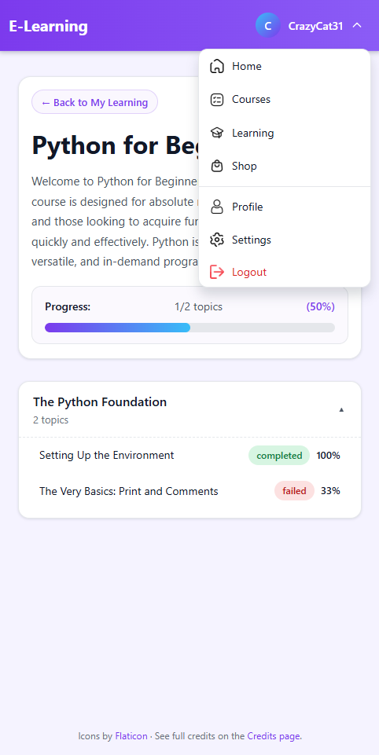

</div>

## 2) Install & use locally

### Prerequisites
- Python 3.11+
- Node 20+
- PostgreSQL running locally (or update DB settings in `backend/elearn_backend/settings.py`).

### Backend (Django + DRF)
1. **Set up environment**
   ```bash
   cd backend
   python -m venv .venv
   source .venv/bin/activate  # on Windows: .\.venv\Scripts\activate
   pip install "Django==5.2.8" djangorestframework djangorestframework-simplejwt django-cors-headers django-filter psycopg2-binary
   ```
2. **Configure PostgreSQL** (defaults expect DB `elearning`, user `elearn_user`). Match them with SQL below or edit `DATABASES` in `elearn_backend/settings.py` (e.g., change `NAME`, `USER`, `PASSWORD`, `HOST`, `PORT`).
   ```sql
   -- open psql as a superuser (e.g., `psql -U postgres`)
   CREATE DATABASE elearning;
   CREATE USER elearn_user WITH PASSWORD 'your_password_here';
   GRANT ALL PRIVILEGES ON DATABASE elearning TO elearn_user;
   ALTER ROLE elearn_user SET client_encoding TO 'UTF8';
   ALTER ROLE elearn_user SET timezone TO 'Europe/Bratislava';
   \q
   ```
3. **Migrate & create a superuser**
   ```bash
   python manage.py makemigrations
   python manage.py migrate
   python manage.py createsuperuser
   ```
4. **Run the API**
   ```bash
   python manage.py runserver  # serves at http://127.0.0.1:8000/
   ```
> Tip: keep `DEBUG` and `ALLOWED_HOSTS` local-friendly, but if you change DB credentials or allowed origins, adjust `CORS_ALLOWED_ORIGINS` and `DATABASES` in `backend/elearn_backend/settings.py` accordingly. For production, set `DEBUG=False` and provide environment variables instead of hardcoded secrets.

### Frontend (React + Vite)
1. ```bash
   cd frontend
   npm install
   npm run dev  # serves at http://localhost:5173/
   ```
2. The app uses `axios` for API calls and `react-router-dom` for navigation. If your backend runs on a different host/port, update the API base URL in `frontend/src/api` (or environment variable `VITE_API_BASE_URL`).

### Create courses via Django admin (so you remember!)
1. Go to `http://127.0.0.1:8000/admin/` and log in with the superuser created above.
2. Add **Users** (in case you need instructors) and **Courses**, then nest **Modules** and **Topics** inside each course.
3. Within each topic, add **Theory text** and **Topic questions** with options and correct answers.
4. Save. The new course instantly appears in the catalog and learning views.


### Navigate the app (quick tour)
- **Catalog (courses_page1):** browse or search the course list. 
- **Course detail (courses_page2):** see description, modules, topics, and enroll. 
- **Learning dashboard (learning_page1_before):** empty state shown before you add courses to "My learning." 
- **Learning dashboard (learning_page1_after):** after adding courses, you see enrolled courses and entry points. 
- **Theory page (theory_page):** topic overview with theory content before starting quizzes. 
- **Timed test option:** quizzes can run with a timer; answers don't reveal correctness until submitted. 
- **Results:** summary of score, pass/fail, and detailed answers. 
- **Learning progress (learning_page2):** track modules/topics with per-topic status: "not started," "passed," or "failed." 
- **History:** review prior attempts and answers. 
- **Admin view:** manage courses, modules, topics, and questions via Django admin at `/admin/`. 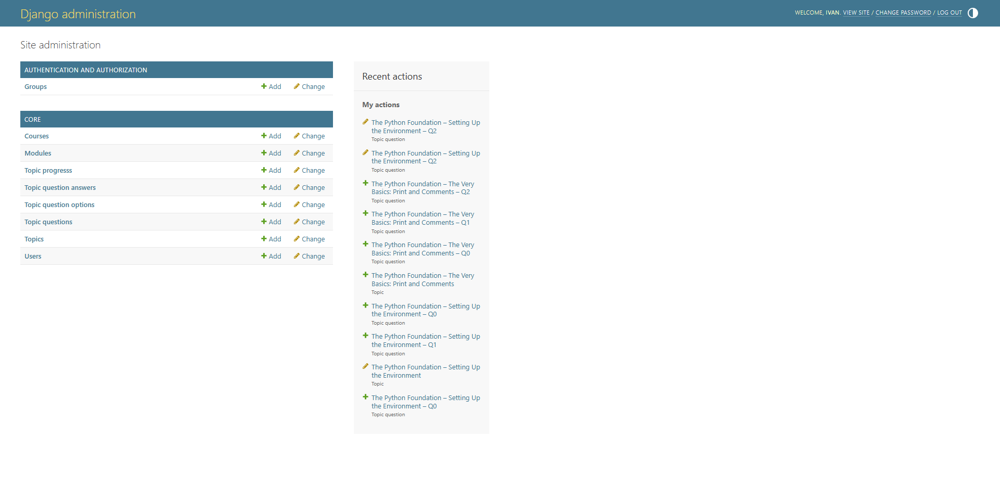

## 3) REST API (backend)

All endpoints are prefixed with `/api/`. Authenticated routes expect a JWT access token in the `Authorization: Bearer <token>` header.

### Auth
- `POST /api/auth/register/` — register a new user (payload: `username`, `email`, `password`).
- `POST /api/auth/token/` — obtain JWT access & refresh tokens.
- `POST /api/auth/token/refresh/` — refresh the access token.
- `GET /api/auth/me/` — current user profile (auth required).

### Courses
- `GET /api/courses/` — public course list (supports `search`, `ordering`, `author_id` filters).
- `GET /api/courses/<id>/` — course details with modules & topics.
- `POST /api/courses/<id>/enroll/` — enroll the authenticated user.
- `GET /api/my-courses/` — courses the current user is enrolled in (auth required).

### Learning & practice
- `GET /api/learning/courses/<id>/` — course content plus per-topic progress (auth + enrollment required).
- `GET /api/learning/topics/<id>/` — topic theory & progress.
- `GET /api/learning/topics/<id>/next-question/` — next practice question, handling timed/untimed flows.
- `POST /api/learning/questions/<id>/answer/` — submit answer(s) (`selected_options` array) and receive correctness + updated progress.
- `POST /api/learning/topics/<id>/reset/` — clear answers and restart practice.
- `GET /api/learning/topics/<id>/history/` — completed/failed topics return full question history with chosen options.

### Response highlights
- Timed topics return `remaining_seconds`, `time_limit_seconds`, `timed_out`, and `passed` flags.
- Progress endpoints surface `progress_percent`, `score_percent`, and per-question correctness to drive the frontend UI.

> Tip: enable CORS for your frontend origin in `backend/elearn_backend/settings.py` when testing from a different host.

### Future plans
>This platform is currently in development and will be expanded soon with the addition of:
>	1.	`User discussions` under each theoretical question.
>	2.	To `integrate an online Python interpreter` and the ability to answer not only single/multiple-choice questions, but also practice writing code in Python.
>	3.	Adding small features such as an `in-app shop`, `settings`, a `profile`, and other minor details.
>	4.	Adding animations, photos, and interactive components. The uniqueness of the app (although it’s almost achieved already) may include custom images.